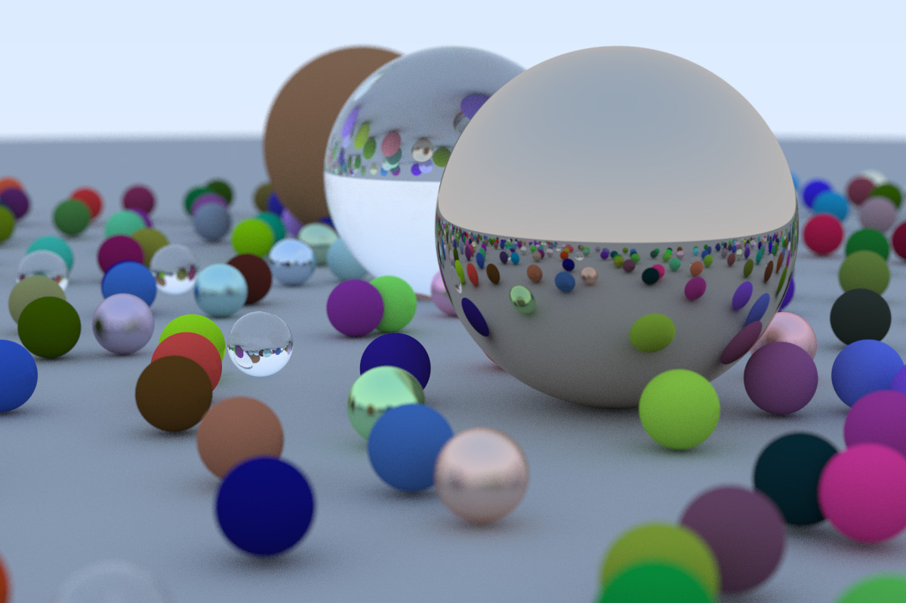

# schmu-raytracing
An implementation of ["Ray Tracing In One Weekend"](https://raytracing.github.io/books/RayTracingInOneWeekend.html) in my [schmu programming language](https://github.com/tjammer/schmu). Currently, only the first book is implemented.

## Usage
1. Grab the schmu language from [its repo](https://github.com/tjammer/schmu) (commit 4f5fd8e) and build it (`dune build`).
2. `make`
3. `make run`

## Gallery

